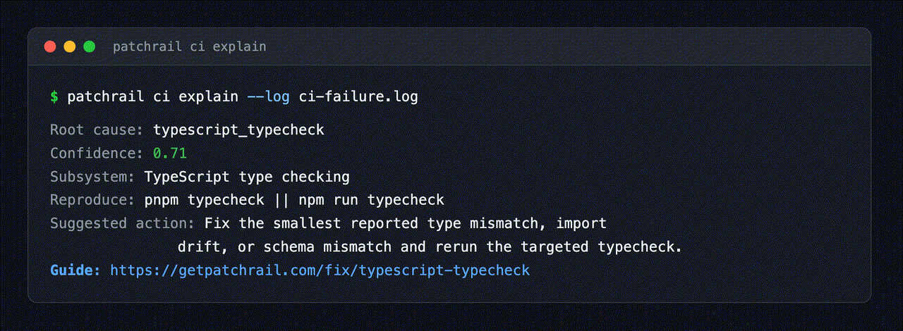

# PatchRail

Local-first CI failure triage for open-source maintainers. Paste a failing CI
log, get the failure class, the reproduction command, and a suggested fix
strategy — in seconds, fully offline.

[](https://pypi.org/project/patchrail/)
[](https://github.com/patchrail/patchrail/actions/workflows/ci.yml)
[](LICENSE)
[](https://pypi.org/project/patchrail/)



The recording above is real output from the bundled
`examples/ci-triage/typescript-import-type-drift.log` fixture. No model calls,
no network, no telemetry: the classifier is a curated rule engine that runs
entirely on your machine.

## Why maintainers use it

- **40 failure classes** backed by real log signatures — dependency
  resolution, flaky network, OOM-killed runners, Docker builds, lint,
  type checks, docs-site builds, and test failures across Python, Node,
  TypeScript, Go, Rust, Java, .NET, Ruby, PHP, C++, and Swift/Xcode. Run
  `patchrail ci classes` to list them all (add `--format json` to check
  coverage from a script).
- **169 sanitized CI log fixtures** keep the classifier honest: every rule is
  benchmarked against the public fixture zoo in `examples/ci-triage/` on every
  test run.
- **23 secret-redaction patterns** (GitHub/GitLab/npm/PyPI/AWS tokens, private
  keys, JWTs, emails, home paths) so logs can be shared safely.
- **Local-first by design**: no network access, no billing, no external model,
  no telemetry. Nothing leaves the machine.
- **Markdown for humans, JSON for automation** — pipe the same result into a
  PR comment or a workflow step.

## Quickstart

PatchRail is published on PyPI:

```bash
pipx install patchrail
```

Classify any failed CI log:

```bash
patchrail ci explain --log failed-ci.log
```

Or try it on a bundled fixture from a clone of this repo:

```bash
git clone https://github.com/patchrail/patchrail
cd patchrail
patchrail ci explain --log examples/ci-triage/dependency-failure.log --format markdown
```

Real output:

```markdown
# PatchRail CI Report

- Root cause: `python_dependency_resolution`
- Confidence: `0.95`
- Subsystem: Python dependency installation
- Reproduce: `python -m pip install -r requirements.txt`
- Suggested action: Pin or relax the conflicting dependency range, then rerun the same install command and the affected tests.

## Evidence signals

- `Could not find a version that satisfies the requirement`
- `ResolutionImpossible`
- `python -m pip install`
```

It also reads from stdin, so you can pipe a log straight in:

```bash
tail -n 200 failed-ci.log | patchrail ci explain
```

Every failure class has a step-by-step remediation write-up in
[docs/fix/](docs/fix/README.md).

## GitHub Action

Run the same triage on every red CI run with
[`patchrail/ci-triage-action`](https://github.com/patchrail/ci-triage-action)
(also on the
[GitHub Marketplace](https://github.com/marketplace/actions/patchrail-ci-triage)).
It classifies the log locally on the runner — no PR, no comment, nothing
leaves the job:

```yaml
- name: PatchRail CI triage
  if: failure()
  uses: patchrail/ci-triage-action@v1
  with:
    log-path: test.log
```

See [examples/ci-triage-action](examples/ci-triage-action/README.md) for the
report artifact shape.

## Features

| Feature | Status | Notes |
| --- | --- | --- |
| CI failure triage (`ci explain`, `ci classify`, `ci classes`) | Beta | 40 failure classes for GitHub Actions-style logs and common toolchains |
| Secret redaction (`redact`, `ci explain --redact`) | Beta | 23 patterns for tokens, keys, emails, and home paths |
| Reports | Beta | Markdown, JSON, and plain text |
| Fixture benchmark (`ci benchmark`) | Beta | Scores the classifier against all 153 public fixtures |
| GitHub Action | Beta | Read-only triage artifact on failed workflows |
| Local queue / control plane (`queue`) | Experimental | SQLite-backed work items with human approval states |
| Funded issue discovery (`funded-issues`) | Experimental (read-only) | Safe-only defaults, no claiming or commenting; see [docs/funded-issues-ethics.md](docs/funded-issues-ethics.md) |

## Local-first & safety

PatchRail never phones home. The classifier needs no API key, no GitHub App,
no repo write permission, and no external model call. Write actions (PRs,
comments, claims) are out of scope; anything that could become one sits behind
an explicit human approval state.

Secret redaction is a first-class feature, not an afterthought. Redact a log
before sharing it anywhere:

```bash
patchrail redact --log failed.log > failed.redacted.log
patchrail ci explain --redact --log failed.log
```

The redaction pass covers GitHub, GitLab, npm, PyPI, AWS, Stripe, Slack,
Google, Hugging Face, and SendGrid credentials, private key blocks, JWTs,
bearer tokens, URL-embedded credentials, `*_TOKEN`/`*_SECRET` environment
assignments, email addresses, and user home paths.

See [ETHICS.md](ETHICS.md), [SECURITY.md](SECURITY.md), and
[docs/threat-model.md](docs/threat-model.md).

## Roadmap

- **v0.3** — public demo of the local agent control plane: SQLite-backed work
  queue, approval gates, and audit export.
- **v0.4** — ethical funded-maintenance workflow: read-only discovery with
  human-gated follow-up, no automated claiming.

Details in [docs/roadmap.md](docs/roadmap.md).

## Documentation

- [Quickstart](docs/quickstart.md)
- [jq cookbook for the JSON classifier output](docs/json-cookbook.md)
- [Fix guides per failure class](docs/fix/README.md)
- [CI Failure Zoo](docs/ci-failure-zoo.md)
- [GitHub Actions CI triage](docs/github-action.md)
- [Agent Control Plane](docs/agent-control-plane.md)
- [API reference](docs/api-reference.md)
- [Threat model](docs/threat-model.md)
- [Funded issue ethics](docs/funded-issues-ethics.md)

## Contributing

The fastest way in is **adding a CI fixture — it takes about 10 minutes**:
grab a failed log, redact it, trim it to the smallest excerpt that still shows
the root cause, and add it with its expected classification under
`examples/ci-triage/`. The full path is in
[CONTRIBUTING.md](CONTRIBUTING.md), and the
[CI failure fixture issue template](.github/ISSUE_TEMPLATE/ci_failure_fixture.md)
works if you are not ready to open a pull request.

Issues labeled
[`good first issue`](https://github.com/patchrail/patchrail/labels/good%20first%20issue)
are scoped for first-time contributors.

Run the checks locally before opening a PR:

```bash
uv run --extra dev pytest -q
uv run --extra dev ruff check .
uv run --extra dev patchrail ci benchmark examples/ci-triage --format json
```

## License

Apache-2.0.
